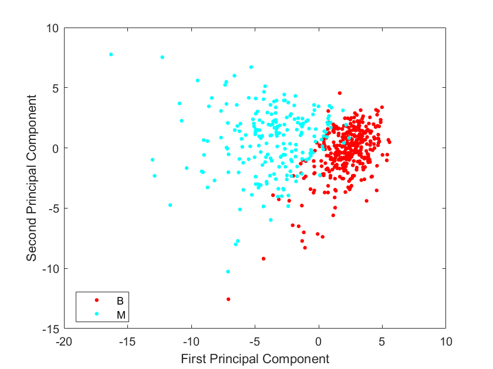
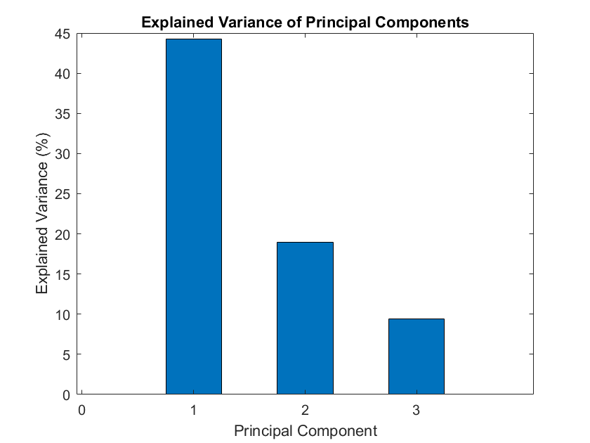
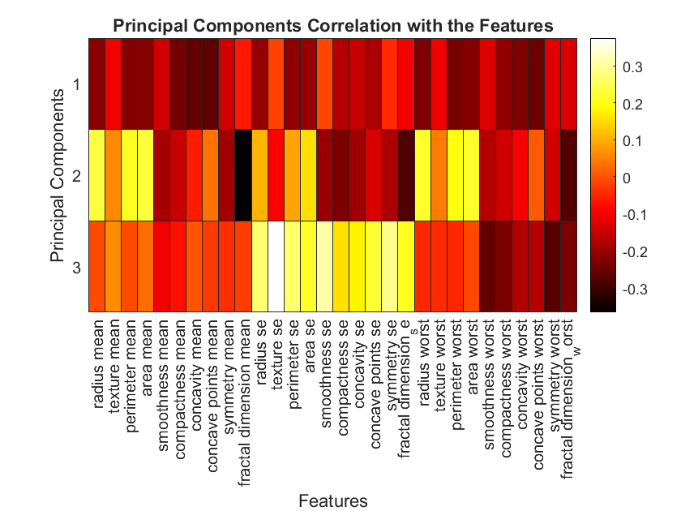

## **Breast Cancer Data Analysis using Principal Component Analysis**

### Dataset
The dataset used here is the Wisconsin Breast Cancer (Diagnosis) dataset, and features are computed from digitized images of fine needle aspiration (FNA) of breast masses. They describe the characteristics of the nuclei present in the image. Features are:
1) ID number
2) Diagnosis (M = malignant, B = benign) \
3-32)

Ten real-valued features are computed for each cell nucleus: \
a) Radius (mean of distances from center to points on the perimeter) \
b) Texture (standard deviation of gray-scale values) \
c) Perimeter \
d) Area \
e) Smoothness (local variation in radius length) \
f) Compactness (perimeter^2 / area - 1.0) \
g) Concavity (severity of the concave part of the profile) \
h) Concave points (number of concave parts of the profile) \
i) Symmetry \
j) Fractal dimension ("coastline approximation" - 1) \

### Analysis Result

From the above figure, we can observe that when the two types of "benign" and "malignant" cells are projected onto the two-dimensional space, they are still linearly separable to a certain extent. In other words, they can be said to be linearly separable. In addition, the data points categorized as "benign" is more scattered than the data categorized as "malignant".

From the figure above, it is clear that the variance contribution rate of the first principal component is the largest, at around 44%. The contribution of the second principal component is around 19%, and the third principal component is around 10%. Using the first to third principal components, we can already obtain  about 73% of the information in the data. If the requirement requires 80% of the information, the fifth principal component can be obtained. It can be seen that the principal component analysis has brought great help to the interpretation of the data.

From the above heatmap we can see the explanatory power of each principal component for each variable. Red or yellow indicates stronger explanatory power, while orange indicates weak explanatory power. Obviously, the first row of the heatmap, which is the first principal component, shows more red, that is, it is more representative of all variables, while the third principal component shows more orange, because its variance contribution rate is relatively low.